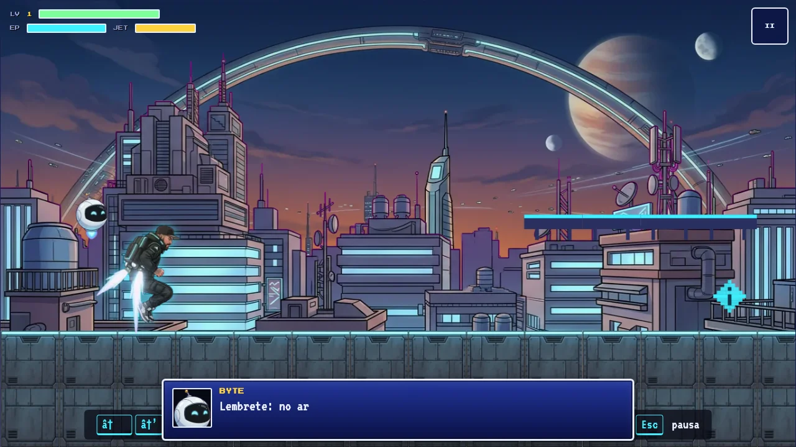
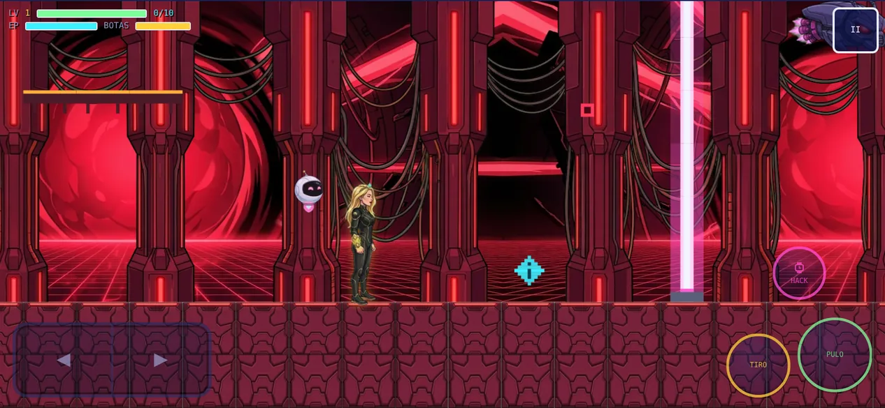

# Montanha: Zero Day

[](https://tiagovilasboas.github.io/montanha-zero-day/) [](https://github.com/sponsors/tiagovilasboas)  

A mobile-first 2D platformer PWA with a Mega Man feel, Final Fantasy flavor and a cyberpunk city.
He went to rescue Gle. Now she's coming for him.

**▶ Play now: [tiagovilasboas.github.io/montanha-zero-day](https://tiagovilasboas.github.io/montanha-zero-day/)** (in-game text is in Brazilian Portuguese)

Works in any modern browser, on desktop with a keyboard and on phones with touch controls. On a phone, use **Add to Home Screen** (or the in-game **Instalar app** button) to install it and play offline.

| Montanha, phase 1 | Gle, phase 3 |
|---|---|
|  |  |

*Leia em português: [README.pt-BR.md](README.pt-BR.md)*

## The game

**Neo-Sampa, 2099.** The invading AI LEGIÃO NULL has taken the planet's network. Gle was kidnapped and locked in a capsule.

- **Phase 1, Telhados do Cecapão.** You play **Montanha**: backpack jetpack, a hacking watch and the robot BYTE. At the end he finds Gle in her capsule (hearts rise), then a RANSOM-TITAN claw snatches him away and Gle is freed.
- **Phases 2 and 3, Subsolo 404: Servidor Submerso and Kernel Panic: o Núcleo.** You play **Gle**, who goes after RANSOM-TITAN with her golden gauntlet, hover boots and a pink BYTE. The Core adds pulse beams that switch on and off in rhythm, a climb over lasers and a turret gauntlet before the boss.
- **Ending.** After the boss, Gle takes RANSOM-TITAN's key and opens Montanha's cell deep in the Core.

### Highlights

- **Two heroes, each with their own style:** Montanha flies with a cyan jetpack, Gle glides on golden light boots. Same physics, distinct look (aura, trail and animations).
- **Hacking:** three puzzle types on terminals (sequence, binary and a node grid with hints), turrets you can turn to your side, and an EMP pulse.
- **Story told in-engine:** dialog with portraits, a phase 1 cutscene (hearts, the claw abduction, Gle breaking free) and an ending that pays it off.
- **The Core (phase 3):** pulse beams that switch on and off in rhythm, a climb over a laser pit, a turret gauntlet and the RANSOM-TITAN boss with a firewall phase.
- **Original soundtrack per stage,** synthesized live with WebAudio.
- **Mobile first:** landscape-only, camera zoom tuned for phones, translucent touch controls, pause when the app goes to the background.
- **Offline PWA:** installable, cache-first service worker.

### Controls

| Action | Keyboard | Touch |
|---|---|---|
| Move | `←` `→` or `A` `D` | D-pad |
| Jump | `Z`, `Space`, `↑` or `W` | PULO |
| Hover (JET / boots) | hold jump in the air | hold PULO |
| Shoot | `X` or `J` (hold to charge, release for a piercing shot) | TIRO |
| Hack | `C` or `K` | HACK |
| Pause | `Esc` or `P` | II |
| Advance dialog | `Enter`, jump or shoot | tap the buttons |

Hack near a red turret to convert it to your side, near a yellow terminal to open its puzzle, and far from everything to fire an EMP pulse that stuns enemies.
The game is landscape-only on phones: in portrait a "rotate your phone" screen appears and the game stays paused (the manifest also requests landscape when installed; the **Tela cheia** button locks it on Android).

## Run it

It is a static site with no build step for development. The service worker needs `http(s)`, so serve the folder instead of opening the file:

```bash
python3 -m http.server 8000
# open http://localhost:8000
```

Progress is stored in `localStorage` under `montanha-zero-day-v1`.

### Build

`index.html` and the icons are generated from `game.html` and the palette in `build.py`:

```bash
pip install pillow
python3 build.py
```

Re-run it whenever `game.html` changes. It also stamps `VERSION` in `sw.js` with a hash of the code and art. Before each deploy, run `python3 build.py --sw` (or the full build) so installed copies refresh.

## Deploy

The live build is served by **GitHub Pages** from the root of `main`: every push updates [tiagovilasboas.github.io/montanha-zero-day](https://tiagovilasboas.github.io/montanha-zero-day/) within a minute or two. Run `python3 build.py --sw` before pushing a release so installed copies pick it up.

Any static host works. Publish the repository root (or just `index.html`, `sw.js`, `manifest.webmanifest`, `css/`, `js/`, `assets/` and `icons/`).

- **GitHub Pages:** free plans need a public repository; private repositories need a paid plan.
- **Cloudflare Pages, Netlify, Vercel:** work with private repositories on free plans. Leave the build command empty and publish the root.

## Project layout

```
index.html, game.html   entry page (index.html is generated from game.html)
sw.js, manifest.webmanifest, icons/   PWA shell
css/style.css           mobile-first UI
js/                     game code, one responsibility per module (see docs/ARCHITECTURE.md)
assets/                 HD art (webp) and animation metadata (anims.json)
tools/process_art.py    raw art -> game assets
tools/gen_art.py        early OpenRouter image generator (optional)
docs/                   architecture and art pipeline
```

## Documentation

- [docs/ARCHITECTURE.md](docs/ARCHITECTURE.md): modules, game loop, camera, events, how to add content.
- [docs/ART_PIPELINE.md](docs/ART_PIPELINE.md): how the art was made and how to regenerate the assets.

## Principles

SRP, KISS, DRY and clean code: each module owns one thing, data lives in `js/config.js`, and modules talk through a small event bus instead of importing each other's internals.

## Credits

Art generated with Artlist (Nano Banana 2 for images, Seedance 1.5 and 2.0 for animation clips) from original prompts and the author's reference photos. Developed with the help of Claude Opus 5.5 (Cowork). Music and sound effects are synthesized in the browser with WebAudio; there are no audio files.

## Support

If you enjoyed the game, you can support new stages and projects on **[GitHub Sponsors](https://github.com/sponsors/tiagovilasboas)**. Stars, bug reports and feedback in the issues help a lot too.

## License

Made by [Tiago Vilas Boas](https://github.com/tiagovilasboas). No license yet. All rights reserved by the author until one is added.
